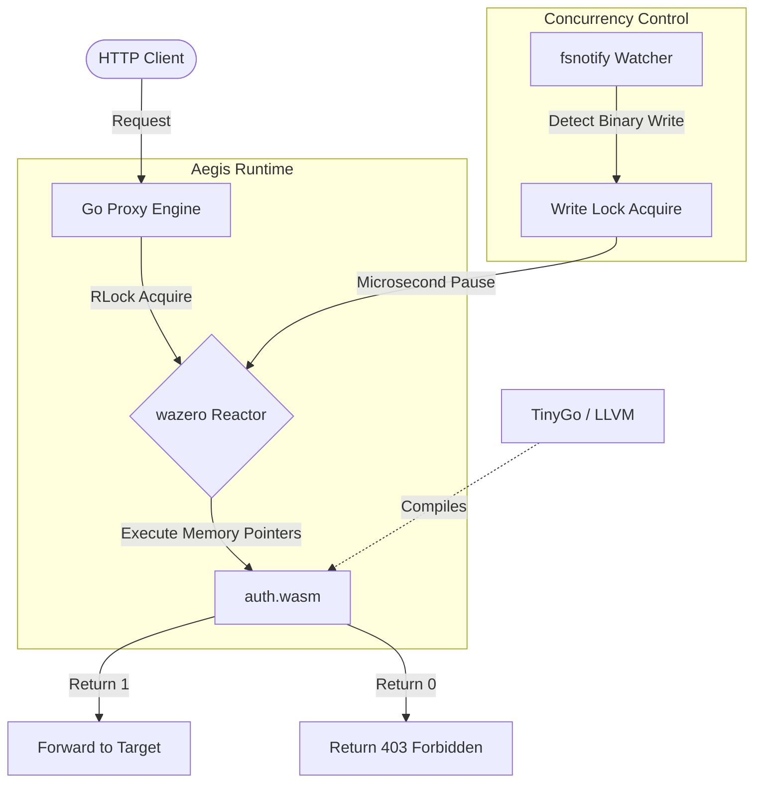

# Aegis: Zero-Downtime Wasm API Gateway

A highly concurrent reverse proxy built in Go, leveraging WebAssembly (WASI) for hot-swappable middleware logic. 

## The Architecture
Aegis separates the network routing engine from the security/business logic. The host (Go) handles high-throughput TCP connections, while the guest (Wasm) handles request authorization in a strictly isolated, default-deny memory sandbox.

### System Flow


## Zero-Downtime Hot-Swapping
Standard gateways require a full process restart to update middleware. Aegis utilizes a debounced kernel-level filesystem watcher. Upon detecting a compiled Wasm binary update, it acquires a brief `sync.RWMutex` write-lock, instantiates a uniquely namespaced Wasm module, swaps the execution pointers, and releases the lock—updating security logic in milliseconds without dropping active TCP connections.

## Known Limitations & Roadmap

* **Single-Threaded Wasm Memory:** Currently, the engine shares a single WebAssembly module instance. While the `sync.RWMutex` safely handles hot-swapping the execution pointers during a live update, highly concurrent load testing (e.g., 100+ simultaneous workers) will induce a race condition on the Wasm linear memory boundary, resulting in a runtime panic.
* **v2 Architecture (The Fix):** The next iteration will implement an **Object Pool Pattern** utilizing Go's `sync.Pool`. The engine will maintain a warm pool of isolated, pre-instantiated Wasm modules, checking them out on a per-request basis to guarantee thread safety under massive concurrent loads.

## Infrastructure Stack
* **Runtime:** [wazero](https://wazero.io/) (Zero-dependency WebAssembly runtime for Go).
* **Compiler:** [TinyGo](https://tinygo.org/) for strict LLVM `//export` pragma adherence.
* **Optimizer:** [Binaryen](https://github.com/WebAssembly/binaryen) (`wasm-opt`) for footprint reduction.

## Build & Execute

**1. Boot the Host Engine**
```bash
go run main.go
```

**2. Compile the Guest Logic**
Modify `plugins/main.go`, then compile it using the WASI target. 
```bash
tinygo build -o plugins/auth.wasm -target=wasi plugins/main.go
```
*Note: Executing the compiler while the host is running will automatically trigger the hot-swap routine.*
